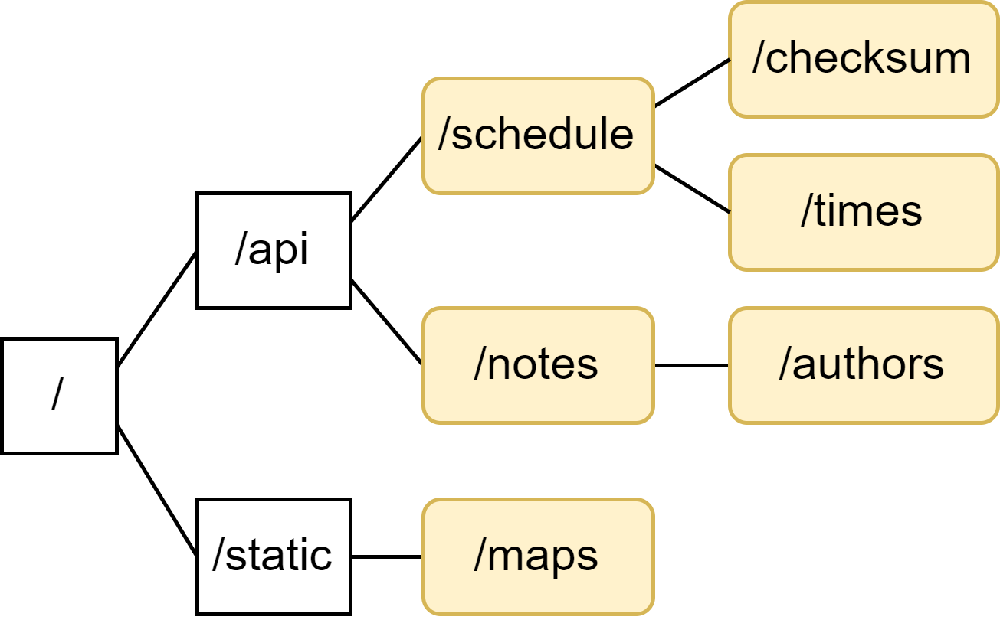

# RTUt

Server side of RTUt –– service for viewing the schedule, searching for audiences and writing notes for classes at RTU MIREA.

## Building
* Clone repository:
    * `git clone https://github.com/Neexol/RTUt-Back.git`
* The project can be built with IntelliJ IDEA 2022.1+
* The project is prepared for deployment to [heroku](https://heroku.com) and [docker](https://www.docker.com/) containerization

## RTUt is built with latest development tools and design patterns
* [Kotlin](https://kotlinlang.org/)
* [Flows](https://kotlinlang.org/docs/flow.html#sequences)
* [Coroutines](https://kotlinlang.org/docs/coroutines-overview.html)
* [PostgreSQL](https://www.postgresql.org/)

## Third party libraries
* [ktor](https://ktor.io/)
* [kotlinx.serialization](https://github.com/Kotlin/kotlinx.serialization)
* [exposed](https://github.com/JetBrains/Exposed)
* [jsoup](https://jsoup.org/)
* [apache poi](https://poi.apache.org/)
* [postgresql jdbc](https://jdbc.postgresql.org/)

## Endpoints
